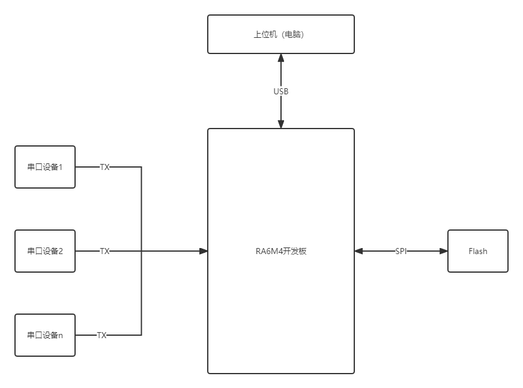
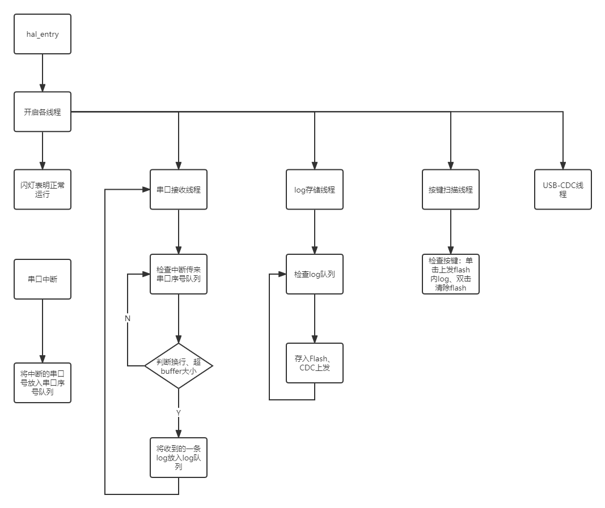
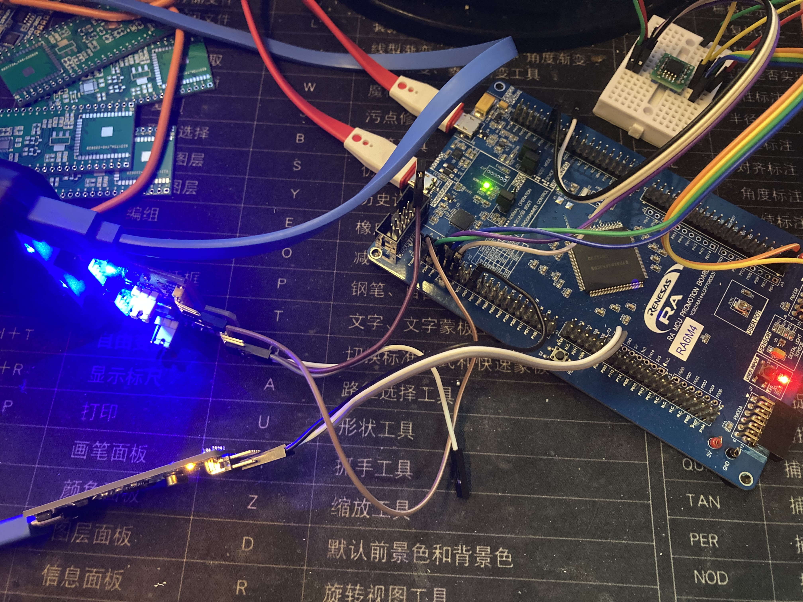

# 基于RT-Thread+RA6M4的多路串口记录仪

本项目制作了一个支持多路串口的记录仪，能记录下多个串口收到的数据，并存储在外部的flash中。并可通过USB-CDC上发flash中存储的数据

## 应用背景

某些时候我们需要调试一个可能不是很好触发的bug，需要通过长时间的log来追踪。单独开着一台电脑进行记录不是很方便，使用一个外挂的离线的串口记录仪更为合适

## 实现功能

* 多路串口接收
* 串口数据存储
* 按键实现不同功能
* USB-CDC上发

## 整体框架

### 硬件框架

多个串口设备连接到ra开发板的串口，ra开发板通过spi接口外接一个flash设备用于存储。在需要读取数据时连接到电脑，进行log的提取。

### 软件框架

软件方面开了许多个线程，中断和线程、线程和线程之间通过队列传递数据。

库使用方面，数据存储使用SFUD+FAL+FlashDB来在Flash上建立一个时序数据库，根据时序存储log数据十分方便。按键扫描使用MultiButton库，能很方便地帮我判断单击和双击。USB库由于RT-Thread的适配暂未做完，直接使用了瑞萨自家的库。由于RT-Thread在RASC中不被适配为RTOS，不开启`BSP_CFG_RTOS`宏，而瑞萨的USB-MSC例程使用了RTOS，故暂未实现MSC来进行直接的log文件读取。

### RT-Thread的使用

* RTT是个很优秀的操作系统，我在我的项目中使用了RTT作为RTOS的线程、队列等操作系统的实现
* RTT有一个对板级适配的HAL层，我在我的项目中SPI、UART及UART中断、GPIO使用的都是RTT提供的HAL层的函数，增强了可移植性。
* RTT还有社区和软件包的适配，本次我使用的三方库都是适配了RTT的版本，只是从RT-Thread Settings内开启即可使用，大大加快了开发途中寻找、适配三方库的速度。

## 实物照片

## 仓库地址

[kaidegit/multi-serial-recoder (github.com)](https://github.com/kaidegit/multi-serial-recoder)
